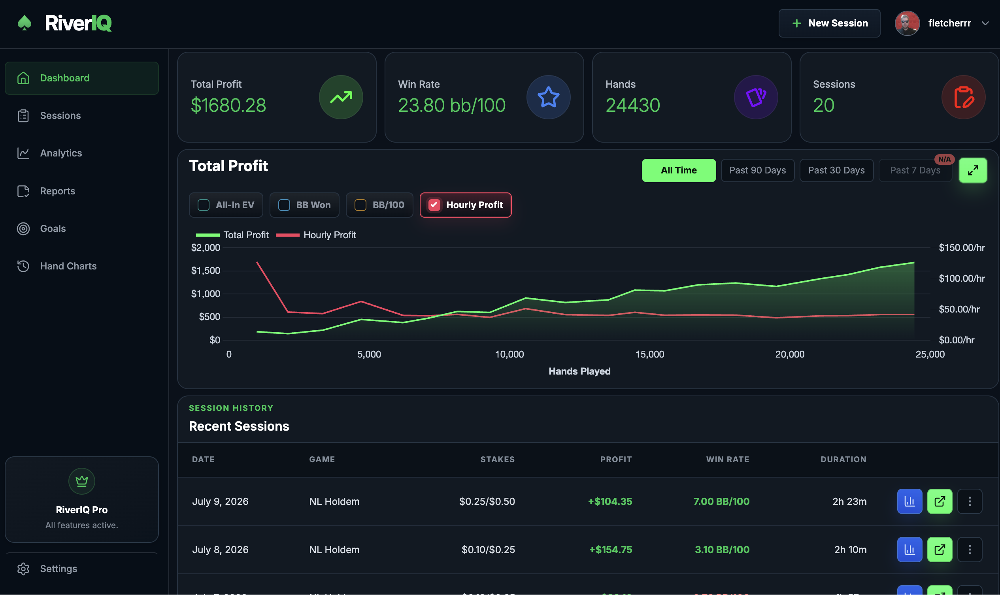
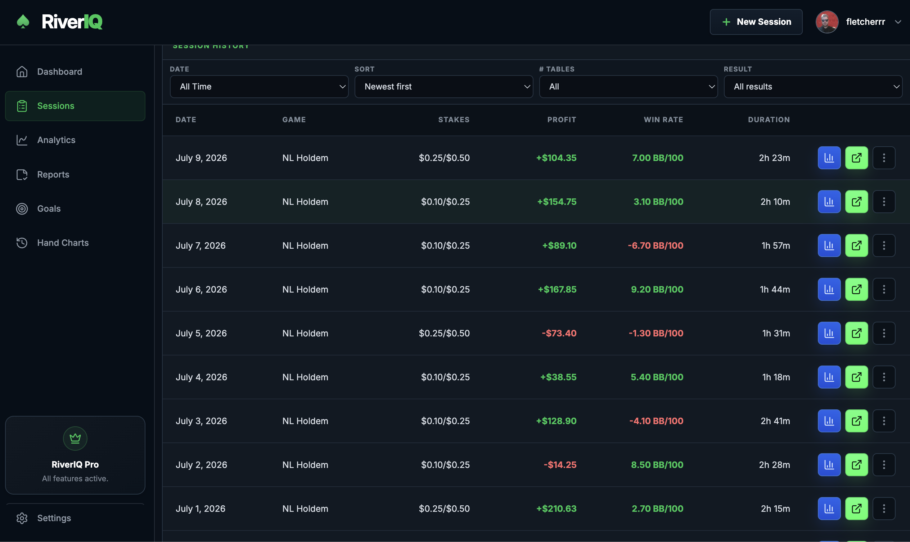
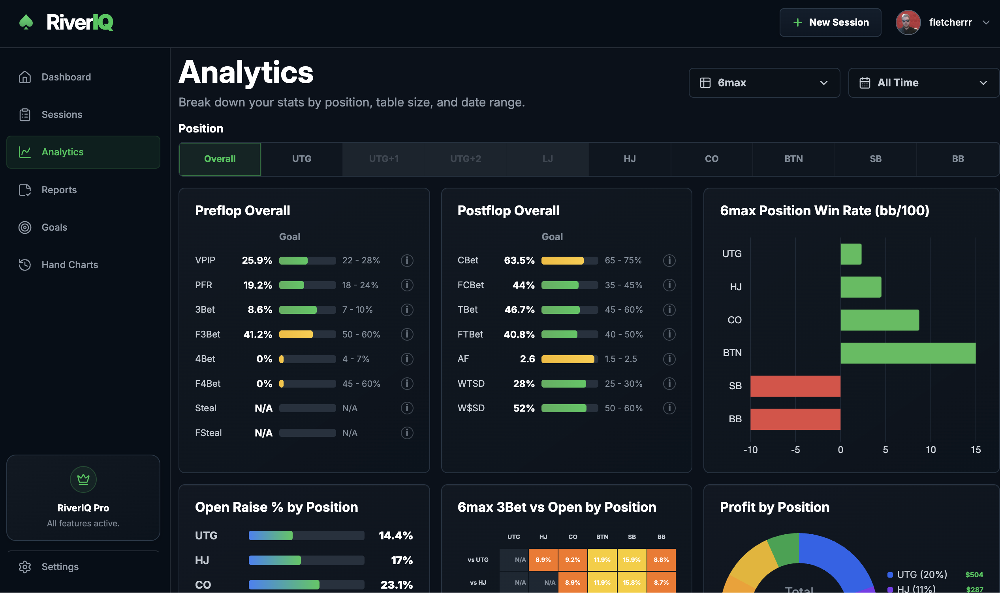
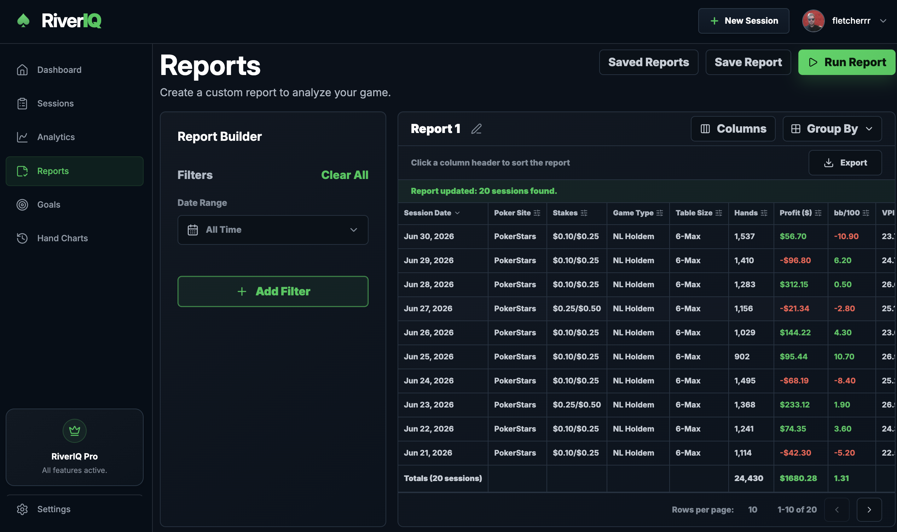
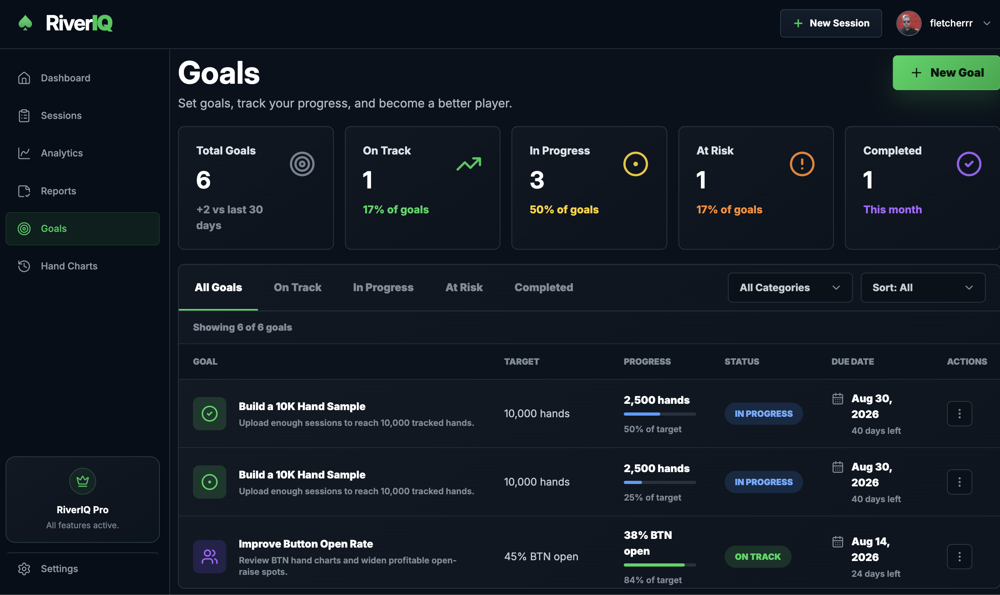
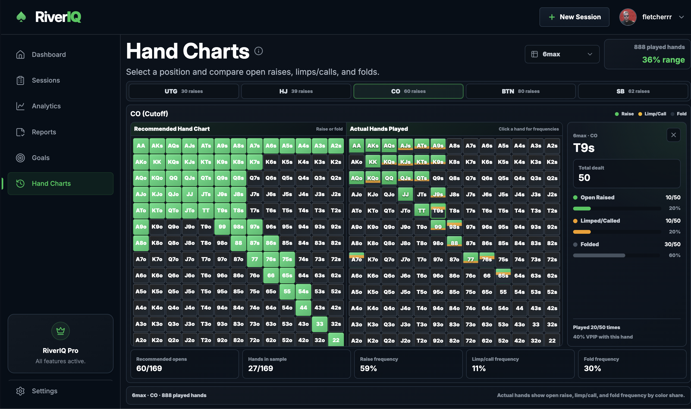

# RiverIQ

RiverIQ is a poker analytics platform that allows players to upload hand history files, automatically parse their sessions, calculate advanced statistics, and visualize their performance through interactive dashboards and reports. RiverIQ is fully responsive and optimized for desktop, tablet, and mobile screens/viewports.

## Tech Stack

| Area     | Tools                                                                     |
| -------- | ------------------------------------------------------------------------- |
| Frontend | React, Vite, React Router, TanStack Query, React Hook Form, Chart.js, CSS |
| Backend  | Node.js, Express.js, MongoDB, Mongoose                                    |

## Authentication

| Tool     | Purpose                                        |
| -------- | ---------------------------------------------- |
| JWT      | Stores signed auth tokens for logged-in users. |
| BcryptJS | Hashes and verifies user passwords.            |

## Cloud Services

| Service       | Purpose                                                    |
| ------------- | ---------------------------------------------------------- |
| Cloudflare R2 | Stores uploaded hand history files and user avatar images. |

## Payments

| Service | Purpose                                              |
| ------- | ---------------------------------------------------- |
| Stripe  | Handles subscription billing and payment processing. |

## Dashboard Page

Provides a high-level overview of the user’s poker performance with key statistics, profit trends, recent sessions, and quick insights into overall results.

## Sessions Page

Displays all uploaded poker sessions in a searchable and sortable table. Users can review session details, monitor results over time, and manage their uploaded sessions.

## Analytics Page

Presents advanced poker statistics calculated from parsed hand histories, including VPIP, PFR, 3-Bet, C-Bet, BB/100, positional analysis, and performance trends to help identify strengths and weaknesses.

## Reports Page

Allows users to build custom reports by filtering sessions based on date ranges, poker site, stakes, and game type, providing deeper analysis of long-term performance.

## Goals Page

Enables users to create and track poker improvement goals, monitor progress, and measure achievements over time.

## Hand Charts Page

Provides recommended preflop hand ranges by position and compares them against the user’s actual hands played to highlight deviations and opportunities for improvement.

## Folder Structure

### Backend

| Path                                  | Purpose                                                                                   |
| ------------------------------------- | ----------------------------------------------------------------------------------------- |
| `backend/.env`                        | Local backend environment variables and secrets. This file should not be committed.       |
| `backend/src/app.js`                  | Creates the Express app, configures global middleware, and mounts API route files.        |
| `backend/src/server.js`               | Loads environment config, connects to MongoDB, and starts the backend server.             |
| `backend/src/config/`                 | Configuration helpers for environment variables, MongoDB, and Stripe.                     |
| `backend/src/controllers/`            | Route handler logic for auth, sessions, payments, goals, and saved reports.               |
| `backend/src/data/`                   | Static backend data and email templates, including welcome and password reset emails.     |
| `backend/src/middleware/`             | Express middleware for auth protection, errors, file uploads, and Cloudflare R2 uploads.  |
| `backend/src/models/`                 | Mongoose models for MongoDB documents such as users, sessions, goals, and saved reports.  |
| `backend/src/routes/`                 | API endpoint definitions grouped by feature area.                                         |
| `backend/src/scripts/`                | Utility scripts for maintenance and backfills.                                            |
| `backend/src/utils/`                  | Shared backend utilities, including JWT creation and parser logic.                        |
| `backend/src/utils/parsers/`          | Hand-history parser system, split by poker site with shared helpers and stat calculators. |
| `backend/src/utils/parsers/fixtures/` | Parser fixture files used to test supported poker-site formats and stat coverage.         |

### Frontend

| Path                            | Purpose                                                                                                                                      |
| ------------------------------- | -------------------------------------------------------------------------------------------------------------------------------------------- |
| `frontend/.env`                 | Local frontend environment variables such as API URL, Google OAuth client ID, and Stripe publishable key. This file should not be committed. |
| `frontend/index.html`           | Vite HTML entry file where the React app is mounted.                                                                                         |
| `frontend/package.json`         | Frontend dependencies and scripts for Vite development, builds, and previews.                                                                |
| `frontend/public/`              | Static public assets served directly by Vite, such as logos, favicon, and hero images.                                                       |
| `frontend/src/main.jsx`         | React entry point that creates the app root and configures providers such as TanStack Query and Google OAuth.                                |
| `frontend/src/App.jsx`          | Main application router and top-level route protection/layout wiring.                                                                        |
| `frontend/src/index.css`        | Global styles, CSS variables, resets, and shared theme styling.                                                                              |
| `frontend/src/api/`             | Frontend API clients for auth, sessions, goals, saved reports, and backend requests.                                                         |
| `frontend/src/assets/`          | App assets imported by React components, including poker-site logos and feature data.                                                        |
| `frontend/src/components/`      | Reusable UI components such as layout, sidebar, navbar, stat cards, charts, tables, and loading screens.                                     |
| `frontend/src/hooks/`           | Custom React hooks for auth, sessions, goals, and saved reports using TanStack Query.                                                        |
| `frontend/src/pages/`           | Route-level page components and their page-specific CSS files.                                                                               |
| `frontend/src/utils/`           | Shared frontend utilities, protected route logic, session filters, and date preference helpers.                                              |
| `frontend/src/utils/analytics/` | Utility logic for analytics calculations and page data shaping.                                                                              |
| `frontend/src/utils/reports/`   | Utility logic for report generation and report-related formatting.                                                                           |

## Features

### Secure Authentication

Create an account and sign in securely using JWT-based authentication. User passwords are hashed before being stored, and protected routes ensure that only authenticated users can access their poker data.

### Hand History Upload

Upload hand history files directly from supported poker sites. RiverIQ validates each file before processing and extracts the raw session data needed for analysis.

### Automatic Hand History Parsing

The parser reads every hand in an uploaded session and converts unstructured text into structured data. Information such as hand number, date, stakes, positions, player actions, and results is extracted automatically.

### Session Tracking

Every uploaded session is stored in your account, allowing you to view your complete playing history. Sessions include important information such as profit, hands played, duration, stakes, poker site, and game type. Further data about the session can be seen by clicking the graph icon on the session table.

### Advanced Poker Statistics

RiverIQ calculates a wide range of statistics from your hand histories, including:

- Hands Played
- Profit
- BB/100
- VPIP
- PFR
- 3-Bet
- Fold to 3-Bet
- Continuation Bet (C-Bet)
- Fold to C-Bet
- Steal Percentage

These statistics provide a detailed overview of your playing style and help identify strengths and weaknesses.

### Interactive Dashboard

View your overall performance at a glance with a modern dashboard that summarizes key metrics, recent sessions, and long-term trends using interactive charts and visualizations.

### Analytics

Dive deeper into your data with detailed analytics pages that break down your performance across multiple statistics, helping you understand where you are improving and where leaks may exist.

### Reports

Generate customizable reports by filtering your sessions using criteria such as date ranges, poker site, stakes, or game type. Reports make it easy to analyze specific portions of your database.

### Goal Tracking

Create personal poker goals and monitor your progress over time. Goals can be marked with statuses such as In Progress or Completed, helping you stay focused on continuous improvement.

### Hand Charts

Compare your own opening ranges against recommended preflop ranges for every table position. This allows you to quickly identify hands you may be playing too frequently or not often enough.

### Dark Mode Interface

A clean, modern dark interface reduces eye strain during long analysis sessions while providing a professional look and feel.

### Scalable Architecture

Built using the MERN stack, RiverIQ separates the frontend, backend, database, and parsing logic into maintainable modules, making it easy to extend with additional poker sites and new analytical features in the future.
