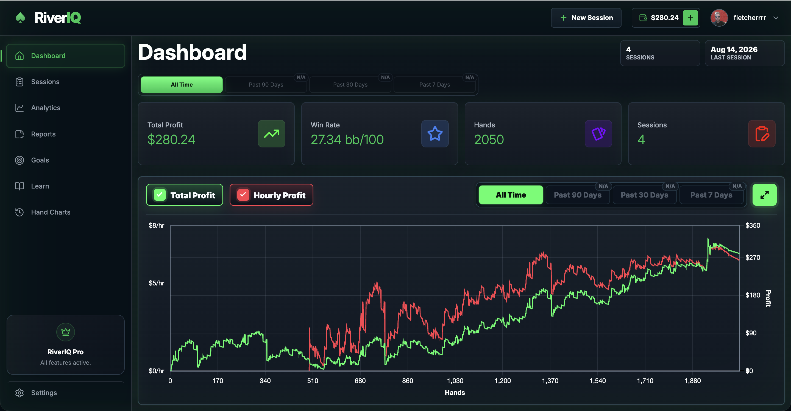
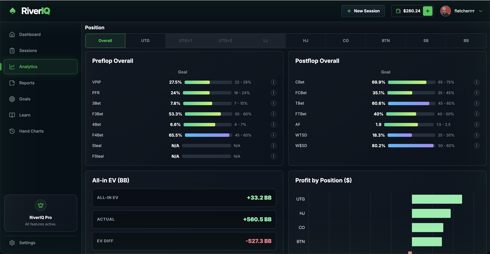
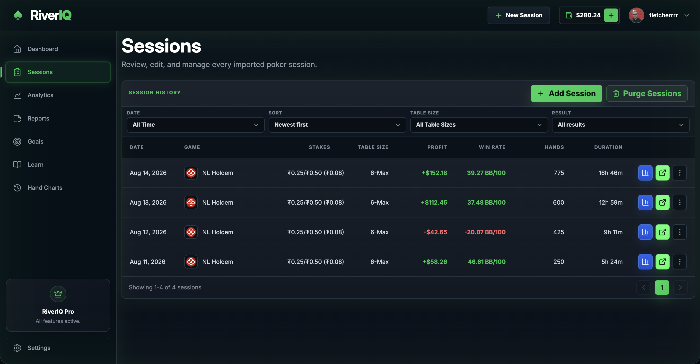
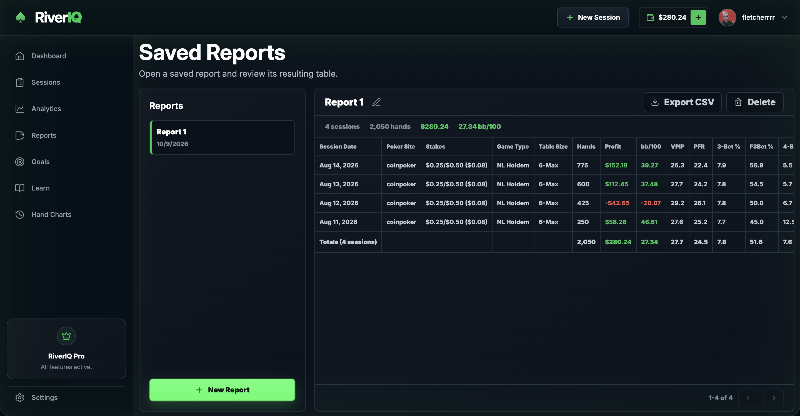

# RiverIQ ♠️

### Poker. Simply.

RiverIQ is a full-stack poker analytics platform designed to help online poker players track their performance, analyze hand histories, and identify areas for improvement.

Built with React, Node.js, Express, and MongoDB, RiverIQ transforms raw poker hand histories into actionable statistics and interactive visualizations.

## Key Features

Hand History Analysis — Parse PokerStars and GGPoker hand histories to extract detailed gameplay statistics.

Performance Dashboard — Visualize profit, win rates, and session performance over time.

Advanced Analytics — Track VPIP, PFR, 3-Bet%, aggression factor, positional performance, and other poker metrics.

Session Management — Upload, organize, edit, and review poker sessions.

Custom Reports — Filter and analyze session data with configurable reports.

Goal Tracking — Set performance goals and monitor progress.

## Tech Stack

Frontend: React, JavaScript, Vite, TanStack Query, Chart.js, CSS

Backend: Node.js, Express.js, MongoDB, Mongoose

Infrastructure & Services: Cloudflare R2, Cloudflare, Render, JWT Authentication, Resend

## Application Preview

### Dashboard
Track overall poker performance through interactive profit graphs, key performance metrics, and session summaries.



### Advanced Analytics
Analyze detailed poker statistics, including preflop tendencies, postflop performance, and positional breakdowns.



### Session Management
Upload hand histories, manage sessions, and review historical performance.



### Custom Reports
Generate personalized reports using configurable filters to explore session data.



## Key Features

### Hand History Analysis
- Parse and process poker hand histories from PokerStars and GGPoker.
- Extract player actions, betting rounds, positions, and hand outcomes.
- Automatically calculate performance statistics from parsed hand data.

### Performance Dashboard
- Track total profit, win rate (bb/100), hands played, and sessions.
- Visualize performance over time using interactive profit graphs.
- Review recent sessions and filter performance by date.

### Advanced Poker Analytics
- Analyze preflop statistics including VPIP, PFR, 3-Bet%, and Fold to 3-Bet%.
- Evaluate postflop performance through C-Bet%, WTSD%, W$SD%, and aggression factor.
- Compare performance across table positions to identify potential weaknesses.

### Session Management
- Upload and process hand-history files.
- Create, edit, delete, and organize poker sessions.
- Track session details including stakes, poker site, profit, and duration.

### Custom Reports
- Generate personalized reports using configurable filters.
- Analyze historical session data and performance trends.
- Export report data to Excel for further analysis.

### Goal Tracking
- Create personalized poker performance goals.
- Monitor progress toward defined targets.
- Track goal completion and performance milestones.

## Tech Stack

### Frontend
- **React** — Component-based user interface
- **JavaScript (ES6+)** — Application logic and functionality
- **Vite** — Development server and build tooling
- **TanStack Query** — Server-state management, caching, and API mutations
- **React Router** — Client-side routing and navigation
- **Chart.js** — Interactive charts and data visualizations
- **CSS3** — Custom styling and responsive layouts

### Backend
- **Node.js** — JavaScript runtime environment
- **Express.js** — RESTful API development and middleware
- **Mongoose** — MongoDB schema modeling and database operations
- **JWT & bcryptjs** — Authentication, authorization, and password hashing
- **Multer** — File upload handling

### Database & Storage
- **MongoDB** — Storage of user accounts, sessions, and performance statistics
- **Cloudflare R2** — Cloud storage for uploaded hand-history files

### Infrastructure & Services
- **Cloudflare** — Frontend hosting
- **Render** — Backend hosting
- **Resend** — Transactional emails and account verification
- **Stripe** — Payment processing and subscription integration

## Technical Implementation

### 1. Hand History Parsing Engine

Developed a custom JavaScript parsing engine to process raw poker hand-history files from multiple poker platforms, including PokerStars and GGPoker.

- Implemented regular expressions to extract hand information, player actions, betting rounds, and outcomes.
- Built parsing functions to transform unstructured text files into structured JavaScript objects.
- Developed position-detection logic to identify player positions based on table size and dealer button placement.
- Implemented platform-specific parsing logic to accommodate differences in hand-history formats.

### 2. Poker Statistics Engine

Developed a custom statistics engine to calculate player performance metrics from parsed hand histories.

- Implemented calculations for VPIP, PFR, 3-Bet%, C-Bet%, aggression factor, and other advanced poker statistics.
- Built aggregation logic to calculate statistics across individual hands and entire sessions.
- Developed position-based analytics to evaluate player performance across different table positions.
- Implemented profit and win-rate calculations using betting actions, hand outcomes, and stake information.

### 3. RESTful API & Database Architecture

Designed and developed a backend using Node.js, Express.js, MongoDB, and Mongoose.

- Built RESTful endpoints for user authentication, session management, and data retrieval.
- Designed Mongoose schemas to manage user accounts, poker sessions, and calculated statistics.
- Implemented CRUD operations for managing session data.
- Integrated the backend with the React frontend using TanStack Query for asynchronous data fetching, caching, and mutations.

### 4. Authentication & Security

Implemented a user authentication system using JWT, bcryptjs, and HTTP-only cookies.

- Developed registration, login, and logout functionality.
- Implemented password hashing using bcryptjs.
- Built authentication middleware to protect restricted API endpoints.
- Integrated email verification using Resend.

### 5. File Upload & Cloud Storage

Developed a file-processing workflow to handle poker hand-history uploads.

- Implemented file upload handling using Multer.
- Integrated Cloudflare R2 for cloud-based file storage.
- Built backend processing logic to parse uploaded hand histories and calculate session statistics.
- Stored processed statistics and file metadata in MongoDB for subsequent retrieval and analysis.

## Getting Started

Follow these instructions to run RiverIQ locally.

### Prerequisites

Ensure you have the following installed:

- Node.js (LTS recommended)
- npm
- MongoDB (local installation or MongoDB Atlas)
- Git

### 1. Clone the Repository

```bash
git clone https://github.com/YOUR_USERNAME/YOUR_REPO.git
cd YOUR_REPO
```

### 2. Install Dependencies

Install dependencies for both the frontend and backend.

```bash
# Frontend
cd client
npm install

# Backend
cd ../server
npm install
```

### 3. Configure Environment Variables

Create a `.env` file in the backend directory.

```env
PORT=5000
MONGO_URI=your_mongodb_connection_string
JWT_SECRET=your_jwt_secret
```

Configure any additional environment variables required for Cloudflare R2, Resend, and Stripe.

If your frontend requires environment variables, create a separate `.env` file in the frontend directory.

### 4. Start the Development Servers

Start the backend:

```bash
cd server
npm run start
```

Open a second terminal and start the frontend:

```bash
cd client
npm run dev
```

### 5. Open the Application

Navigate to the local URL displayed by Vite, typically:

```text
http://localhost:5173
```

You can now access RiverIQ in your browser.

## Roadmap

RiverIQ is an ongoing project, with several features and improvements planned for future development.

- [ ] **Cross-Platform Desktop Application** — Develop a desktop version for Windows and macOS using Electron.
- [ ] **Automatic Hand History Importing** — Monitor local hand-history folders and automatically import new hands.
- [ ] **Expanded Poker Site Support** — Add compatibility with additional online poker platforms.
- [ ] **Advanced Leak Detection** — Identify potential weaknesses in player strategies using statistical analysis.
- [ ] **RiverIQ Performance Score** — Develop a custom scoring system to evaluate overall player performance across multiple statistical categories.
- [ ] **Enhanced Data Visualization** — Introduce additional charts, positional heatmaps, and performance comparisons.
- [ ] **Performance Optimization** — Improve processing efficiency for large hand-history files and datasets.

## Author

**Scott Smyth**  
Full-Stack Developer

RiverIQ is an independently developed project showcasing my experience in full-stack development, API design, database management, data processing, and interactive web applications.

**Connect with me:**

- **GitHub:** [GitHub Profile](https://github.com/scottsmyth01)
- **LinkedIn:** [LinkedIn Profile](https://www.linkedin.com/in/scottwsmyth)
- **Email:** ssmythwilliam@gmail.com

---

Built with React, Node.js, Express, and MongoDB.
