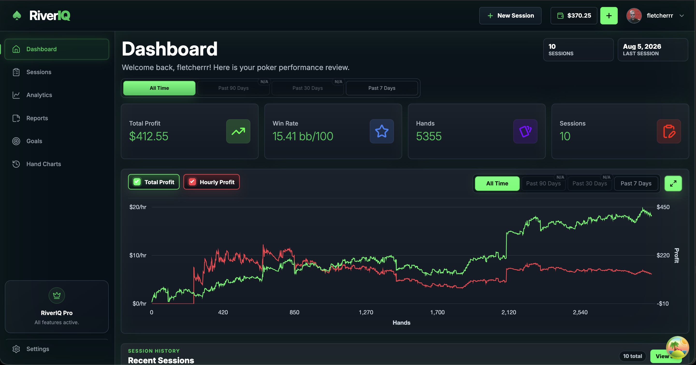
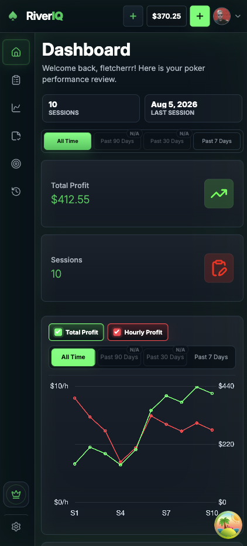

# RiverIQ

RiverIQ is a poker analytics platform for uploading hand-history files, parsing sessions automatically, and turning raw poker data into dashboards, reports, goals, and preflop hand-chart insights.

## Screenshots

### Performance Dashboard



### Mobile Experience



## Features

- Upload and parse hand-history files from supported poker sites.
- Track sessions with profit, hands played, duration, stakes, site, and game type.
- Review dashboard stats, profit trends, recent sessions, and BB/100 performance.
- Analyze advanced stats including VPIP, PFR, 3-Bet, 4-Bet, C-Bet, fold frequencies, WTSD, W$SD, AF, and steal metrics.
- Build custom reports from filtered session data.
- Create and manage poker improvement goals.
- Compare actual hands played against recommended preflop ranges by position.
- Use a responsive dark-mode interface across desktop, tablet, and mobile.

## Tech Stack

| Area     | Tools                                                                       |
| -------- | --------------------------------------------------------------------------- |
| Frontend | React, Vite, React Router, TanStack Query, React Hook Form, Chart.js, CSS   |
| Backend  | Node.js, Express, MongoDB, Mongoose                                         |
| Auth     | JWT, BcryptJS, Google OAuth                                                 |
| Storage  | Cloudflare R2                                                               |
| Payments | Stripe                                                                      |
| Testing  | Vitest, Testing Library, Playwright, Jest, Supertest, MongoDB Memory Server |

## Project Structure

```text
RiverIQ/
├── backend/
│   ├── src/
│   │   ├── config/          # Environment, database, and Stripe config
│   │   ├── controllers/     # Route handler logic
│   │   ├── data/            # Email templates and fixture data
│   │   ├── middleware/      # Auth, upload, R2, and error middleware
│   │   ├── models/          # Mongoose models
│   │   ├── routes/          # Express routes
│   │   ├── scripts/         # Backfill and fixture generation scripts
│   │   ├── test/            # Test server and DB setup
│   │   └── utils/           # JWT helpers and hand-history parser logic
│   └── package.json
├── frontend/
│   ├── public/              # Static assets and README screenshots
│   ├── src/
│   │   ├── api/             # API clients
│   │   ├── assets/          # Imported app assets
│   │   ├── components/      # Reusable UI components
│   │   ├── data/            # Static frontend data
│   │   ├── hooks/           # React Query/auth hooks
│   │   ├── pages/           # Route-level views
│   │   └── utils/           # Shared frontend utilities
│   └── package.json
└── README.md
```

## Getting Started

### Prerequisites

- Node.js `22.22.0` or newer
- MongoDB connection string
- Stripe keys for subscription billing
- Cloudflare R2 credentials for hand-history and avatar uploads

### Install Dependencies

```bash
cd backend
npm install

cd ../frontend
npm install
```

### Environment Variables

Create `backend/.env`:

```env
PORT=
MONGO_URI=
JWT_SECRET=
NODE_ENV=
BACKEND_URL=
FRONTEND_URL=
COOKIE_SAME_SITE=
CLOUDFLARE_KEY=
SUPPORT_NOTIFY_EMAIL=ssmythwilliam@gmail.com
R2_ACCOUNT_ID=
R2_ACCESS_KEY_ID=
R2_SECRET_ACCESS_KEY=
R2_BUCKET_NAME_HH=
R2_BUCKET_NAME_AVATAR=
R2_PUBLIC_URL_AVATAR=
STRIPE_PUBLISHABLE_KEY=
STRIPE_SECRET_KEY=
STRIPE_PRICE_ID=
STRIPE_YEARLY_PRICE_ID=
STRIPE_WEBHOOK_SECRET=
GOOGLE_CLIENT_ID=
```

In production, `STRIPE_YEARLY_PRICE_ID` must be a Stripe Price ID, and
`STRIPE_WEBHOOK_SECRET` must be the signing secret for your Stripe webhook
endpoint. Configure both in your deployment's environment settings.

Create `frontend/.env`:

```env
VITE_API_URL=
VITE_STRIPE_PUBLISHABLE_KEY=
VITE_GOOGLE_CLIENT_ID=
```

### Run Locally

Start the backend:

```bash
cd backend
npm start
```

Start the frontend in a second terminal:

```bash
cd frontend
npm run dev
```

## Tests

Run backend tests:

```bash
cd backend
npm test
```

Run frontend tests:

```bash
cd frontend
npm test
```

Run frontend end-to-end tests:

```bash
cd frontend
npm run test:e2e
```

## Supported Poker Data

The parser code includes fixtures and wrappers for multiple poker-site formats, including PokerStars, GG Poker, 888poker, CoinPoker, FanDuel, and partypoker. Parser logic lives in `backend/src/utils/parsers`.

## License

ISC
